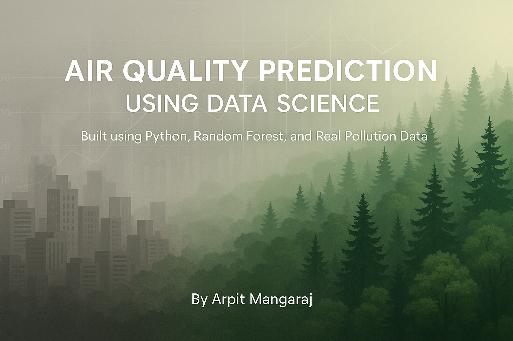
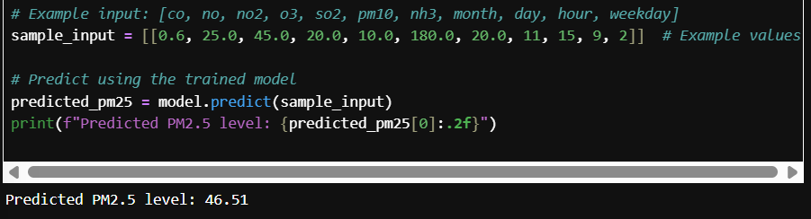

## 🚀 Project Banner 

# 🌫️ Air Quality Prediction Using Data Science

This project predicts PM2.5 air pollution levels using real-world pollutant and time-based data collected from Delhi. It applies machine learning models like **Random Forest Regression** and achieves high accuracy on test data.

## 📌 Features
- Data Cleaning & Preprocessing
- Exploratory Data Analysis (EDA)
- Feature Engineering (time-based & pollutant data)
- Machine Learning: Random Forest Regressor
- Feature Importance Analysis
- PM2.5 Prediction on New Data

## 🧪 Tech Stack
- Python (Pandas, NumPy, Seaborn, Scikit-learn)
- Jupyter Notebook
- Kaggle Dataset
- Random Forest Regression

## 📈 Model Accuracy
Achieved **R² Score: 99.5%** on test set  
Also calculated MAE, RMSE, and feature importances

## 📂 Files
- `Air_Quality_Prediction.ipynb`: Full code notebook
- `delhi_aqi.csv`: Dataset used (or sample)
- `project_banner.png`: Banner for LinkedIn/GitHub
- `README.md`: This file

## 📊 Sample Output

## 🧠 Author
[Arpit Mangaraj](https://www.linkedin.com/in/arpit-mangaraj-894049256/)

---

⭐ Star this repo if you found it helpful!
